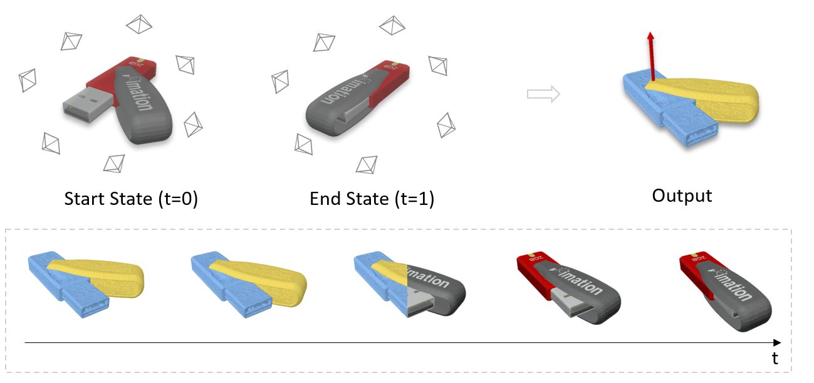
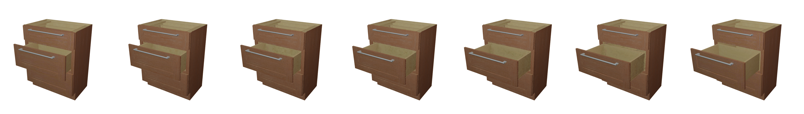

# PARIS
<a href="https://pytorch.org/"></a>
<a href="https://pytorchlightning.ai/"></a>
### PARIS: Part-level Reconstruction and Motion Analysis for Articulated Objects


[Jiayi Liu](), [Ali Mahdavi-Amiri](https://www.sfu.ca/~amahdavi/), [Manolis Savva](https://msavva.github.io/)

Accepted by ICCV 2023

[Project](https://3dlg-hcvc.github.io/paris/) | [Paper]() | [Data](https://aspis.cmpt.sfu.ca/projects/paris/dataset.zip)



## Setup
We recommend the use of [miniconda](https://docs.conda.io/en/latest/miniconda.html) to manage system dependencies. The environment was tested on Ubuntu 20.04.4 LTS with a single GPU (12 GB memory required at minimum).

Create an environment from the `environment.yml` file.
```
conda env create -f environment.yml
conda activate paris
```

Then install the torch bindings for [tiny-cuda-nn](https://github.com/NVlabs/tiny-cuda-nn):
```
pip install ninja git+https://github.com/NVlabs/tiny-cuda-nn/#subdirectory=bindings/torch
```

## Data
We release both synthetic and real data shown in the paper [here](https://aspis.cmpt.sfu.ca/projects/paris/dataset.zip). After downloaded, folders `data` and `load` should be put directly under the project directory.
```
PARIS
├── data                    # for GT motion and meshes
│   ├── sapien              # synthetic data
│   │   │   ├── [category]        
│   ├── realscan            # real scan data
│   │   │   ├── [category]  
├── load                    # for input RGB images

```

Our synthetic data is preprocessed from the [PartNet-Mobility](https://sapien.ucsd.edu/browse) dataset. If you would like to try out more examples, you can refer to `preprocess.py` to generate the two input states by articulating one part and save the meshes. Then you can render the multi-view images with `<state>.obj` as training data.

## Run
### Test Pretrained Models
Downloaded pretrained models from [here](https://aspis.cmpt.sfu.ca/projects/paris/pretrain.zip) and put the folder under the project directory.

You can render the intermediate states of the object by trying the `--predict` mode.
```
python launch.py --predict \
        --config pretrain/storage/config/parsed.yaml \
        --resume pretrain/storage/ckpt/last.ckpt \
        dataset.n_interp=3   # the number of interpolated states to show
```
This will give you a image grid under `exp/sapien/storage` folder as below. It shows the interpolation from state t=0 to t=1 with ground truth at both ends.

<details>
  <summary>Got errors running the command above?</summary>

  If you are not on a local machine, you might encounter an issue from `opencv` and `open3d` saying
  ```
  ImportError: libGL.so.1: cannot open shared object file: No such file or directory
  ```
  You can obtain the missing files by installing `libglfw3-dev`

  ```
  apt update && apt install -y libglfw3-dev
  ```
</details>
You can also render test images, reconstruct part geometries and get motion estimation by trying the `--test` mode. It could take a while to render all the 50 images. You can optionally add `--mesh_only` to skip the rendering process.
```
python launch.py --test \
        --config pretrain/storage/config/parsed.yaml \
        --resume pretrain/storage/ckpt/last.ckpt
```

### Training
Run `python launch.py --train` to train the model from the scratch.  For example, to train the storage above, run the following command:
```
python launch.py --train \
        --config configs/prismatic.yaml \
        source=sapien/storage/45135 
```
For objects with a revolute joint, run with `--config configs/revolute.yaml`. 

If the motion type is not given, it can be also estimated by running with `--config configs/se3.yaml` in ~5k steps. We recommend to switch back to the specialized configuration once the motion type is known to further estimate other motion parameters for better performance. Please check out our paper for details.

## Citation
```
@article{jiayi2023paris,
        author    = {Liu, Jiayi and Mahdavi-Amiri, Ali and Savva, Manolis},
        title     = {PARIS: PARIS: Part-level Reconstruction and Motion Analysis for Articulated Objects},
        year      = {2023},
}
```
## Aknowledgements
The NeRF implementation is powered by [tiny-cuda-nn](!https://github.com/NVlabs/tiny-cuda-nn) and [nerfacc](!https://github.com/KAIR-BAIR/nerfacc). Please check out their great work for more details!